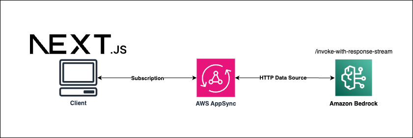

# AppSync subscriptions with Bedrock response stream API

## Goal
The goal of this repository is to showcase the ability of directly connecting to Bedrock response stream endpoint via Appsync Subscription without any Lambda.

The integration is done via HTTP Data source and the result can be consumed as the response of a subscription in the web app's console.




## Configuration
Deploy the application:
```sh
cd backend
cdk deploy
```

Grab the `cdk output` in the console and fill the parameters in [_app.tsx](src/pages/_app.tsx)
```ts
Amplify.configure({
    aws_appsync_graphqlEndpoint:
      'https://XXXXX.appsync-api.<REGION>.amazonaws.com/graphql',
    aws_appsync_region: 'us-west-2',
    aws_appsync_authenticationType: 'API_KEY',
    aws_appsync_apiKey: 'da2-YYYYYY'
  })
```

Now run:
```sh
npm run dev
```

And connect to the app url.


When calling the `invoke` mutation via the AWS web console or external client, the result will be streamed to the console in the nextjs app.


